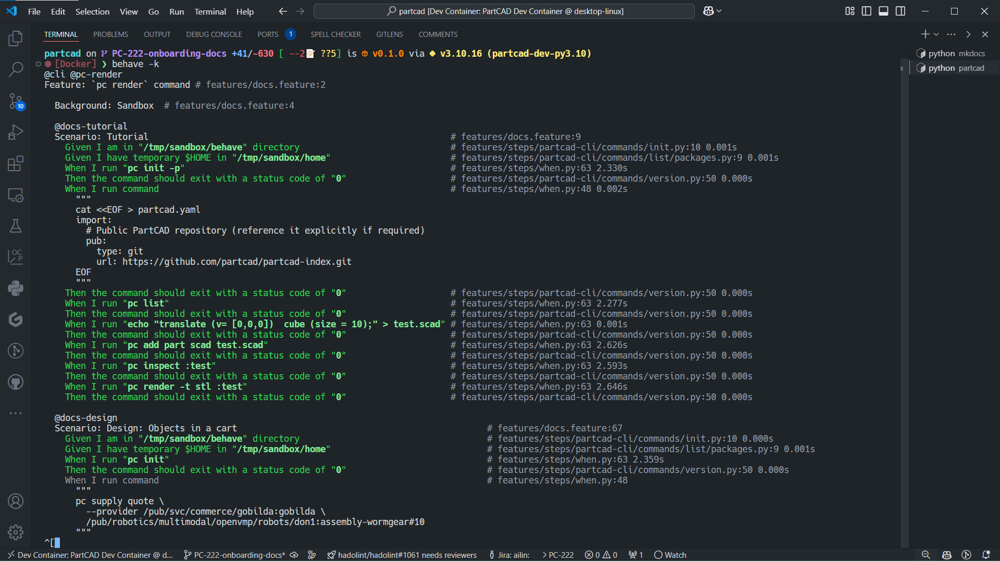

---
tags:
  - Development
  - Explanation
---

# Environment

Our team is using :material-microsoft-visual-studio-code: Visual Studio Code and :simple-docker: Docker which boosts
software development by providing a powerful, customizable editor and ensuring consistent environments with
containerization.

VS Code's rich extensions and debugging tools integrate seamlessly with Docker, allowing developers to write, test, and
debug code within containers.

This setup eliminates environment inconsistencies, accelerates development, and improves team collaboration.

## Docker

Docker helps build, share, run, and verify applications anywhere — without tedious environment configuration or
management. There are two main options how to setup Docker.

If you do not have previous experience with Docker, then here is good place to start:

- [Docker Docs - Get Started]

### Engine

If your primary development system is Linux then you can install Docker daemon directly on your host, see [Install] for
more details on how to install it in distributution you're using.

!!! quote

    _[Docker Engine] is an open source containerization technology for building and containerizing your applications.
    Docker Engine acts as a client-server application with:_

    - A server with a long-running daemon process [dockerd].
    - APIs which specify interfaces that programs can use to talk to and instruct the Docker daemon.
    - A command line interface (CLI) client [docker].

    The CLI uses [Docker APIs] to control or interact with the Docker daemon through scripting or direct CLI commands.
    Many other Docker applications use the underlying API and CLI. The daemon creates and manages Docker objects, such as
    images, containers, networks, and volumes.

    For more details, see [Docker Architecture].

### Desktop

If you're working on macOS or Windows, you can still install Engine, but that would require managing a local Linux VM.
Docker Desktop provides a convenient solution and handles the required virtualization for you:

- [Install on Mac]
- [Install on Windows]

!!! quote

    _[Docker Desktop] is a one-click-install application for your Mac, Linux, or Windows environment that lets you build,
    share, and run containerized applications and microservices._

## Visual Studio Code

VS Code available for macOS, Linux, and Windows, has extensible architecture and has rich customization and integration
options. Here is good place to get familiar with it:

- [Setting up Visual Studio Code]

!!! quote

    _Visual Studio Code combines the simplicity of a source code editor with powerful developer tooling, like IntelliSense
    code completion and debugging._

    _First and foremost, it is an editor that gets out of your way. The delightfully frictionless edit-build-debug cycle
    means less time fiddling with your environment, and more time executing on your ideas._

### Dev Containers

VS Code also provides seamless integration with Docker for managing environments by supporting [Dev Containers]
specification.

!!! quote

    _The Visual Studio Code Dev Containers extension lets you use a container as a full-featured development environment.
    It allows you to open any folder inside (or mounted into) a container and take advantage of Visual Studio Code's full
    feature set. A [devcontainer.json] file in your project tells VS Code how to access (or create) a development
    container with a well-defined tool and runtime stack. This container can be used to run an application or to separate
    tools, libraries, or runtimes needed for working with a codebase._

Following docs section provides good overview of available features:

- [Developing inside a Container]

[Dev Containers]: https://containers.dev/
[Install on Mac]: https://docs.docker.com/desktop/setup/install/mac-install/
[Install on Windows]: https://docs.docker.com/desktop/setup/install/windows-install/
[Install]: https://docs.docker.com/engine/install/
[Docker Architecture]: https://docs.docker.com/get-started/docker-overview/#docker-architecture
[Docker APIs]: https://docs.docker.com/reference/api/engine/
[docker]: https://docs.docker.com/reference/cli/docker/
[dockerd]: https://docs.docker.com/reference/cli/dockerd
[Docker Desktop]: https://docs.docker.com/desktop/
[Docker Docs - Get Started]: https://docs.docker.com/get-started/
[Docker Engine]: https://docs.docker.com/engine/
[Setting up Visual Studio Code]: https://code.visualstudio.com/docs/setup/setup-overview
[devcontainer.json]: https://code.visualstudio.com/docs/devcontainers/containers#_create-a-devcontainerjson-file
[Developing inside a Container]: https://code.visualstudio.com/docs/devcontainers/containers
