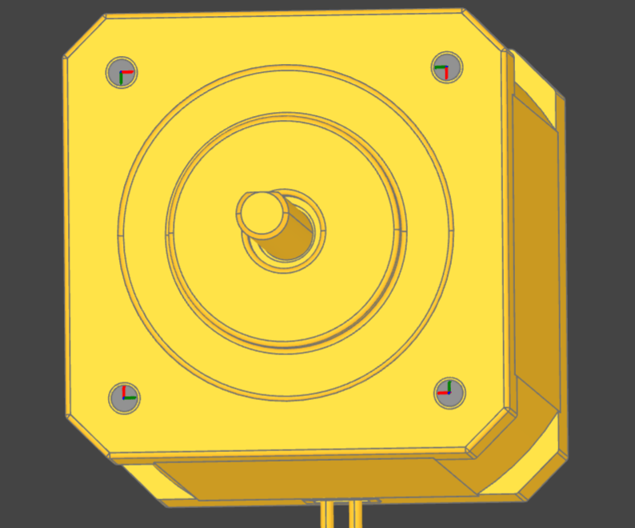

#######################
Sketches and interfaces
#######################

.. _sketches:

========
Sketches
========

Sketches are declared in ``partcad.yaml`` using the following syntax:

.. code-block:: yaml

  sketches:
    <sketch-name>:
      type: <basic|dxf|svg|cadquery|build123d>
      desc: <(optional) textual description>
      path: <(optional) the source file path, "{sketch name}.{ext}" otherwise>
      fileFrom: <(optional) "url" to download the source file instead of keeping it in the package>
      fileUrl: <(fileFrom=url only) the URL to download the source file from>
      # ... type-specific options ...

Basic
-----

The basic sketches are defined using the following syntax:

.. code-block:: yaml

  sketches:
    <sketch-name>:
      type: basic
      desc: <(optional) textual description>
      # The below are mutually exclusive options
      circle: <(optional) radius>
      circle:  # alternative syntax
        radius: <radius>
        x: <(optional) x offset>
        y: <(optional) y offset>
      square: <(optional) edge size>
      square:  # alternative syntax
        side: <edge size>
        x: <(optional) x offset>
        y: <(optional) y offset>
      rectangle: <(optional)>
        side-x: <x edge size>
        side-y: <y edge size>
        x: <(optional) x offset>
        y: <(optional) y offset>
      slot: <(optional)>
        length: <overall length, measured over the rounded ends>
        width: <width, which is the diameter of those ends>
        x: <(optional) x of the centre of the first rounded end>
        y: <(optional) y of the centre of the first rounded end>
        angle: <(optional) degrees to turn it about that point, 0 = along X>
      inner: <(optional) the shapes cut out of the one above>
        circle: <(optional) radius>
           ...
        square: <(optional) edge size>
           ...
        rectangle: <(optional)>
           ...
        slot: <(optional)>
           ...
        circles: <(optional) several of them at once>
          - ...
        squares: ...
        rectangles: ...
        slots: ...

There must be only one field ``circle``, ``square``, ``rectangle`` or ``slot`` at the top level of the sketch.
Inside ``inner`` each shape may be given once by its own name, and several at a time in the plural list beside it.

A **slot** is a rectangle with semicircular ends -- two arcs and two lines --
which is what a slotted hole is. ``length`` is measured over those ends, the way
a drawing dimensions it, so a slot as long as it is wide is a circle rather than
an error.

Unlike the other shapes, a slot is placed by the centre of its **first** rounded
end rather than by its middle, and ``angle`` turns it about that point. That is
where a slot comes from: it is a hole that may also sit somewhere else, so it
starts where the plain hole would have been and runs ``length - width`` from
there. A port keeps its coordinates when the opening it marks is slotted, and
the freedom of movement that goes with it runs from zero rather than from half a
slot back. It is also the only one of these shapes whose direction is part of
what it is.

.. code-block:: yaml

  sketches:
    m4-slotted-30:
      desc: The boundary of an M4 hole that may sit anywhere in the next 26mm
      type: basic
      slot: { length: 30.0, width: 4.0 }

DXF
---

A sketch can be defined using a `DXF <https://en.wikipedia.org/wiki/AutoCAD_DXF>`_ file.
Such sketches are declared using the following syntax:

.. code-block:: yaml

  sketches:
    <sketch-name>:
      type: dxf
      desc: <(optional) textual description>
      path: <(optional) filename> # otherwise "<sketch-name>.dxf"
      tolerance: <(optional) tolerance used for merging edges into wires>
      include: <(optional) a layer name or a list of layer names to import>
      exclude: <(optional) a layer name or a list of layer names not to import>

.. _sketch-layers:

Layers, and reading one drawing several ways
^^^^^^^^^^^^^^^^^^^^^^^^^^^^^^^^^^^^^^^^^^^^

``include`` and ``exclude`` are **object-type parameters**: the ``dxf`` type
contributes them rather than the author of the sketch inventing them, in the
same way ``material``, ``color`` and ``tolerance`` are contributed to a part (see
:ref:`parameters`). Two things follow from that, and both are the point of it.

First, they exist whether or not the declaration mentions them, so whoever
*refers* to the sketch can set them -- and a reference is the natural place for
this to be decided, because which layers are wanted depends on what the sketch is
being used for:

.. code-block:: yaml

  sketches:
    panel:
      type: dxf       # one drawing: the outline, the bend lines, the notes

  parts:
    sheet:
      type: step                        # the stock the blank is cut out of

    blank:
      type: extrude
      sketch: panel;include=OUTLINE     # the flat pattern
      depth: 2.0
      manufacturing:
        method: subtractive
        source: sheet

    bracket:
      type: step
      manufacturing:
        method: sheet_metal
        source: blank
        instructions: panel;include=BEND_UP,BEND_DOWN   # the bends, from the same drawing

A list is written with commas in it, as above. Nothing has to be declared in
advance for either reference to work, and each of them is its own sketch --
with its own cache entry -- so the two do not have to be rendered twice or kept
in step by hand.

Layer names are matched **case-insensitively**, and only one of ``include`` and
``exclude`` may be given -- both are the DXF importer's own rules. A reference
setting either of them is deciding how the drawing is read, so it replaces what
the declaration said rather than being added to it: a sketch declaring
``include: [OUTLINE]`` and referred to as ``panel;exclude=NOTES`` is read by
that exclusion alone. A reference that sets *both* is refused, the way a
declaration writing both is.

A drawing whose selected layers do not close into faces is imported as the
**wires** it draws. That is what a drawing of bend lines is: two parallel lines
across a blank are where it is folded, and a line is open by nature. PartCAD
says so when it happens, because the other way to arrive there is an outline
with a gap in it, which is a mistake rather than a drawing of lines.

Second, the fields above are the **default** the reference overrides. They go on
meaning exactly what they always meant, and a sketch that carries neither reads
every layer. The long form is available too, for a sketch that wants to describe
its own default:

.. code-block:: yaml

  sketches:
    panel:
      type: dxf
      parameters:
        include:
          desc: The layers this drawing is read from
          type: array
          default: [OUTLINE]

Every other sketch type rejects the two names, the way a part type rejects an
object-type parameter it cannot honour: a layer is something a DXF has, and
accepting the parameter silently on an SVG would leave a package believing it was
filtering something.

.. _sketch-annotations:

Annotations
^^^^^^^^^^^

A DXF entity may carry **extended data** -- XDATA -- which is what an application
wrote against that entity, in the file, beside the geometry. It is where a
drawing states what the geometry cannot: two identical lines are a bend up
through 90 degrees and a bend down through 30, and nothing about the lines says
which.

PartCAD reads it as the file is imported and carries it beside the geometry from
then on, so it is a property of the **sketch** rather than of the file it came
from. That is what lets :ref:`sheet metal instructions <sheet-metal>` be a
sketch: the check reads what the sketch reports, and a sketch type that learns to
state the same thing needs no change anywhere else. Today ``dxf`` is the only
type that states anything, so sheet metal instructions have to be read from a DXF
in practice -- but not by anything's design.

Both of the usual spellings are read, and either may be used:

.. code-block:: text

  1001 PARTCAD          the APPID, as DXF requires
  1000 angle=90         a key and its value in one string tag...
  1000 radius=1.5
  1000 direction=up

  1001 PARTCAD
  1000 angle            ...or the name, followed by the value as its own type
  1040 90.0

Keys are read case-insensitively -- ``ANGLE`` and ``angle`` are one key -- and
values are kept exactly as the file states them. What is carried per element is
its DXF type, its layer, its handle, where it is, and those key/value pairs; an
element with no extended data is still carried, with nothing against it, because
"this drawing annotates nothing" and "this line was left un-annotated" are
different answers. The layer filters above apply, so the annotations describe
what is in the sketch and not what was filtered out of it.

``pc info`` on the sketch prints them, under ``Annotations``, beside what the
drawing says about *itself*: which DXF it is, what ``$INSUNITS`` says its
numbers are in, and -- under ``Layers`` -- **every** layer the file has, with
how many elements of which types are on each and whether this sketch reads it.
That last is not the question the annotations answer, and it is why the drawing
is described as well as read: a layer filter that matched nothing and a layer
that is not in the file both produce a sketch with nothing in it.

A STEP file states the same kind of thing in its own vocabulary -- a
``PROPERTY_DEFINITION`` hung on a product or on one named feature of one, and
``PRESENTATION_LAYER_ASSIGNMENT`` for its layers -- and ``pc info`` on a
``step`` part or assembly reports those under ``Properties`` and ``Layers``,
with the keys lower-cased the same way.

SVG
---

A sketch can be defined using an `SVG <https://en.wikipedia.org/wiki/SVG>`_ file.
Such sketches are declared using the following syntax:

.. code-block:: yaml

  sketches:
    <sketch-name>:
      type: svg
      desc: <(optional) textual description>
      path: <(optional) filename> # otherwise "<sketch-name>.svg"
      use-wires: <(optional) boolean>
      use-faces: <(optional) boolean>
      ignore-visibility: <(optional) boolean>
      flip-y: <(optional) boolean>

CAD Scripts
-----------

See the "CAD Scripts" section in the "Parts" chapter below.

.. _interfaces:

==========
Interfaces
==========

Interfaces are declared in ``partcad.yaml`` using the following syntax:

.. code-block:: yaml

  interfaces:
    <interface name>:
      abstract: <(optional) whether the interface is abstract>
      desc: <(optional) textual description>
      path: <(optional) the source file path, "{interface name}.{ext}" otherwise>
      alias: <(optional) the interface this one is another name for>
      threadStep: <(optional) axial distance per full turn of a connection made through this interface, in mm>
      selfScrew: <(optional) whether this interface cuts its own thread instead of matching one>
      multiConnect: <(optional) whether one instance of this interface may take more than one object>
      inherits: # (optional) the list of other interfaces to inherit from
        <parent interface name>: <instance name>
        <other interface name>: # instance name is implied to be empty ("")
        <yet another interface>:
          <instance name>: <OCCT Location object> # e.g. [[x_off,y_off,z_off], [x_rot,y_rot,z_rot], rot_angle]
        <and another>:
          <instance name>:
            location: <OCCT Location object>
            sketch: <(optional) the boundary this instance's ports are drawn with>
      ports:  # (optional) the list of ports in addition to the inherited ones
        <port name>: <OCCT Location object> # e.g. [[x_off,y_off,z_off], [x_rot,y_rot,z_rot], rot_angle]
        <other port name>: # [[x_off,y_off,z_off], [x_rot,y_rot,z_rot], rot_angle] is implied
        <another port name>:
          location: <OCCT Location object> # e.g. [[x_off,y_off,z_off], [x_rot,y_rot,z_rot], rot_angle]
          sketch: <(optional) name of the sketch used for visualization>
          params: # (optional) the parameter values to build that sketch with
            <sketch parameter name>: <value or "%expression%">
      parameters:
        # The values this interface is built from, declared exactly as a part's
        # or a sketch's are, and set by a reference: "<interface>;<name>=<value>"
        <parameter name>:
          type: <string|int|float|bool>
          default: ...
        <other parameter name>: <value> # short form, same as for parts and sketches
        # ... and, in the same section, what a connection made through this
        # interface may still do:
        moveX: # (optional) offset along X
          min: <(optional) min value>
          max: <(optional) max value>
          default: <(optional) default value>
        moveY: [<min>, <max>, <(optional) default>] # alternative syntax
        moveZ: ... # (optional) offset along Z
        turnX: ... # (optional) rotation around X
        turnY: ... # (optional) rotation around Y
        turnZ: ... # (optional) rotation around Z
        <custom parameter name>: # (optional) offset or rotation with an arbitrary direction vector
          min: ...
          max: ...
          default: ...
          type: <move (default)|turn>
          dir: [<x>, <y>, <z>] # the vector to move along or rotate around
      motion: # (optional) the degrees of freedom a connection keeps; see "Joints" below
        dof: [<parameter name>, ...] # the freedom-of-movement parameters that stay free
        type: <fixed|revolute|continuous|prismatic|cylindrical|screw|universal|ball|planar|floating>
        axis: [<x>, <y>, <z>] # in the frame of this interface's port; Z by default
        limits: # for a revolute, prismatic or screw type: degrees for a turn, millimetres for a move
          lower: ...
          upper: ...
        softLimits: # (optional) limits a controller enforces before the hard ones
          lower: ...
          upper: ...
          kPosition: ...
          kVelocity: ...
        mimic: # (optional) a movement that follows another one
          joint: <the name of the joint it follows>
          multiplier: ...
          offset: ...
      # motion: revolute  # the short form of 'motion: {type: revolute}'
      physics: # (optional) what moving the joint costs
        maxEffort: ... # N*m for a turn, N for a move
        maxVelocity: ... # deg/s for a turn, mm/s for a move
        damping: ... # N*m*s/rad for a turn, N*s/m for a move
        friction: ... # N*m for a turn, N for a move
        springStiffness: ... # N*m/rad for a turn, N/m for a move
        springReference: ... # degrees for a turn, millimetres for a move

.. _joints:

Joints
------

A connection between two interfaces is a composition of rigid transforms: the
target's port, a half turn that makes the two ports face each other, then every
freedom-of-movement parameter the connection gives a value to (``toParams``,
``withParams``; see `Interface parameters`_). What none of that says is which of
those parameters **stay free** once the parts are joined. A slotted hole's
``moveX`` is an *adjustment*: the screw is tightened and it is fixed. A bearing's
``turnZ`` is a *degree of freedom*: it turns while the machine runs. A connection
that keeps any degree of freedom is a **joint**, and ``motion:`` is where they
are declared.

Declaring degrees of freedom
^^^^^^^^^^^^^^^^^^^^^^^^^^^^

**Explicitly**, by naming the parameters that stay free. The parameter already
says its kind, its direction and its range, so nothing is restated:

.. code-block:: yaml

  interfaces:
    hinge-bore:
      ports: { bore: [[0, 0, 0], [0, 0, 1], 0] }
      parameters:
        turnZ: [-150, 150, 0]   # where a connection may place it
      motion:
        dof: [turnZ]            # and it stays free once joined
      physics:
        damping: 0.05           # N*m*s/rad
        maxEffort: 2.0          # N*m
        maxVelocity: 180        # deg/s

A predefined name (``moveX`` ... ``turnZ``) need not be declared under
``parameters:`` to be named here: the name says its kind and its axis, and a
degree of freedom with no declared range is unlimited. Any other name has to be a
freedom-of-movement parameter of the interface.

**Implicitly**, by naming a kind of joint. Every degree of freedom it implies is
declared - about the port's Z axis unless ``axis:`` says otherwise, between
``limits:`` where those apply:

======================= ====================================================================
``type``                Degrees of freedom
======================= ====================================================================
``fixed``               none
``revolute``            one turn about ``axis``, within ``limits``
``continuous``          one turn about ``axis``, unlimited
``prismatic``           one move along ``axis``, within ``limits``
``cylindrical``         one turn and one move, about and along ``axis``
``screw``               the same two, the move following the turn by the ``threadStep``
``universal``           two turns, about ``axis`` and about the port's X axis
``ball``                three turns about the port's origin
``planar``              two moves across the plane normal to ``axis``, and one turn about it
``floating``            all six
======================= ====================================================================

``motion: revolute`` is the short form of ``motion: {type: revolute}``. ``limits``
bound the one freedom of a ``revolute`` or ``prismatic`` motion and the turn of a
``screw`` (whose move follows it); a kind with more than one degree of freedom
states the range of each on its parameter and names them in ``dof`` instead.

An implied degree of freedom is the interface's parameter of the same kind along
the same axis when there is one - which is what makes it addressable from
``toParams`` - and otherwise one it brings along: ``turnZ``, ``moveX`` and their
siblings along a principal axis, ``angle`` and ``offset`` along any other (the
names ``pc convert assembly -t assy`` writes). Either way a connection can give
it a value. A ``motion:`` that states both a ``type`` and a ``dof`` list has to
describe one set of freedoms, and ``pc test`` says where it does not; the ``type``
still decides the range (a ``continuous`` joint has none) and ``dof`` which
parameters they are.

Where it is declared
^^^^^^^^^^^^^^^^^^^^

In three places, most specific first - the precedence a mating's ``how`` already
has:

1. the connection's own ``motion:`` in the ASSY file (``connect: {motion: fixed}``
   locks a joint, for one test or one variant; see :ref:`assy-joints`);
2. the mating's ``motion:`` - what this *pair* does, whatever each would do with
   another partner: a 6 mm pin turns in a clearance bore and is fixed in a
   press-fit one.

   .. code-block:: yaml

     interfaces:
       pin-6:
         mates:
           bore-6-h7:
             motion: revolute
           bore-6-press:
             motion: fixed

3. the two interfaces' own ``motion:``, combined.

An interface that inherits exactly one other one, once (``inherits: bore``), or
is an ``alias:`` of it, is that interface under another name and moves as it does
unless it says otherwise. One assembled out of several - a bolt pattern of four
pins - inherits no ``motion``: four pins in four holes do not turn.

The axis of a mating's ``motion`` is in the frame of the port of the interface
that declares the mating; a connection's is in the contact frame (below). A name
in a mating's or a connection's ``dof`` means that parameter on either interface.

How two interfaces combine
^^^^^^^^^^^^^^^^^^^^^^^^^^

The two sides' freedoms are in series - which is how the placement composes them
too, the target's parameters and then the connected object's - so they **add**:

* the degrees of freedom are the union of both sides';
* two that lie on the same axis are one, whose range is the sum of the two ranges
  and whose value is the sum of the two values, and which is unlimited if either
  is.

"On the same axis" means the same kind (two turns, or two moves) on the same line
in the contact frame, with every degree of freedom at zero and every adjustment
at its value; two moves need only point the same way. Opposite directions match,
with the sign of one of them flipped. Two swivels in series, each declaring
``turnZ: [-90, 90]``, are one revolute joint over -180 to 180 degrees; a slotted
plate on a slotted bracket is one prismatic joint over the sum of the two slots.
Two freedoms are left apart when something that moves lies between them in a way
that would turn one relative to the other - a slide between two parallel turns
moves one turn off the other's axis as soon as it slides.

The rule has one trap, and it is documented rather than special-cased: a
symmetric hinge whose two leaves *both* declare ``turnZ: [0, 90]`` comes out with
180 degrees of travel. A freedom is declared on the side that provides it.

**Both sides read their parameters in the contact frame**, which is where the two
ports meet: the connected object's port, and the target's port turned round to
face it. That is how a connection has always been placed, and it has one
consequence a joint makes visible: a target interface's ``turnZ`` turns the child
about the contact frame's Z, which is the target port's own Z *reversed* - so a
target's +30 degrees turns the child -30 degrees about the target port's Z, and a
target's ``limits`` written about its own port's Z come out the other way round
on ``turnZ``. A ``motion:`` on an interface states its ``axis`` in its own port's
frame, as written; PartCAD maps it.

What it costs
^^^^^^^^^^^^^

``physics:`` on an interface, a mating or a connection, with the precedence of
``motion:``. Where both interfaces state physics they are taken together, and a
value they both state has to agree, or the mating has to state its own: two
dampers in series do not add, so there is no sum to take. ``pc test`` reports a
disagreement.

Damping and a joint's friction are SI per unit of the joint's motion -
N*m*s/rad and N*m for a turn, N*s/m and N for a move - because that is what every
engine takes and what a URDF's ``<dynamics>`` states. It is the one place an
angle is not in degrees.

Every other property has a PartCAD name and a PartCAD unit too, and the set of
them is closed: angles are degrees and lengths millimetres, as everywhere else in
PartCAD, and the rest is SI. Nothing is stored under the name of the format it
came from. A format that states something PartCAD has no property for fails the
import rather than tucking the value away, and a property PartCAD holds that a
target format cannot state is reported when it is exported - so the gap is
always visible in one direction or the other.

``pc convert assembly -t assy`` fills ``motion:`` and ``physics:`` in from a URDF's
joints - see :doc:`simulation` for the mapping - and what it writes is an
implicit declaration of the joint it was. ``pc info -a <assembly>`` lists an
assembly's joints, and :ref:`assy-joints` how a connection names, locks and
starts one.

Abstract interfaces
-------------------

Abstract interfaces can't be implemented by parts directly.
They also can't be used for mating with other interfaces.
They are a convenience feature so that a property can be implemented once
but inherited multiple times by all child interfaces.

Port visualization
------------------

When a part or an assembly is rendered (in a GUI or when exported to a file),
the ports can be visualized.
When ports are visualized, each port looks like a coordinate system (3D location, direction and rotation)
and, optionally, as a 2D image of an alleged "boundary" (or "silhouette") of the port.

It is recommended to define the port boundary at all times.
Here is an example how to define the port boundary using a primitive sketch:

.. code-block:: yaml

  sketches:
    m3:
      type: basic
      circle: 3.0
  interfaces:
    m3:
      ports:
        m3:
          sketch: m3

Here is how it will get visualized:

.. image:: images/interface-m3.png
  :width: 50%
  :align: center

The same two things are drawn on a rendered projection by
``pc render --with-ports`` and ``--with-interfaces`` (``--with-all`` for both):
a marker and a name at each port, and each interface instance named once with a
line out to every port that belongs to it, over the port boundaries above. An
assembly or a :ref:`scene <scenes>` is taken at its word -- what is drawn is
what it says its ports are (see :ref:`assembly-ports`) -- and
``--with-internals`` draws what is inside one anyway, each child's ports placed
where the assembly put the child, which is how a connection that did not come
out as intended is found. See :doc:`cli`, and :ref:`drawing-ports` for asking a package to keep such a
drawing checked in.

Port matching
-------------

Each port has the coordinates of the logical center of the port and the
direction (orientation) of the port.
Whenever two ports are meant to connect without any offset or angle
(e.g. male and female connectors), their coordinates should match
and their directions should be opposite (rotated 180 degrees around [1, 1, 0]).
The suggested convention is to use the Z-axis (blue) as the main direction.
Male ports should have the Z-axis pointing outwards, while female ports should
have the Z-axis pointing inwards.

Matching multiple ports
-----------------------

Sometimes there are multiple interchangeable ports within one interface.
For example, take a look at the NEMA-17 mounting ports:

It is desired that any mounting port of the motor can be connected to any
mounting port of the bracket.
That can be achieved by orienting the ports in a circular direction.
See how the X-axis (red) is pointing to the next port clockwise (right-hand rule).
If any pair of ports is aligned then all three other port pairs are aligned too.

.. image:: images/interface-orientation-2.png
  :width: 50%
  :align: center

.. _interface-parameters:

Interface parameters
--------------------

Each interface may declare parameters to allow parametrized mating
(e.g. a slotted hole allows for a mating at an offset within the size of the slot).
There is a list of predefined parameters that are easy to use:

  - moveX, moveY, moveZ: offset along X, Y, and Z axes
  - turnX, turnY, turnZ: rotation around X, Y, and Z axes

.. code-block:: yaml

  interfaces:
    <interface name>:
      parameters:
        moveX: # (optional) offset along X
          min: <(optional) min value>
          max: <(optional) max value>
          default: <(optional) default value>

However custom parameters can be defined to use an arbitrary direction vector
and an arbitrary offset or rotation.

.. code-block:: yaml

  interfaces:
    <interface name>:
      parameters:
        <custom parameter name>:
          min: ...
          max: ...
          default: ...
          type: <move (default)|turn>
          dir: [<x>, <y>, <z>] # the vector to move along or rotate around

When the interface is inherited or used to connect parts, the parameter values
get resolved and applied as inheritance or connection coordinate offsets.

.. code-block:: yaml

  # Interface inheritance with parameters
  interfaces:
    <interface name>:
      # ...
      inherits: # (optional) the list of other interfaces to inherit from
        <parent interface name>:
          <instance name>:
            params:
              moveX: 10

  # Interface implementation with parameters
    parts:
    <part name>:
      # ...
      implements: # (optional) the list of other interfaces to inherit from
        <interface name>:
          <instance name>:
            params: { moveX: 10 }

  # Assembly YAML connection example
  links:
    - part: <target part>
    - part: <source part>
      connect:
        name: <target part>
        toParams:
          turnZ: 1.57

A connection reads both interfaces' parameters in the **contact frame**: the
frame where the two ports meet, which is the connected part's port and the target
part's port turned round to face it. A move is in millimetres and a turn in
degrees, about the frame's origin, in the order the connection names them. So the
target's ``turnZ`` turns the connected part about the target port's own Z axis
*reversed*. A parameter is an adjustment, fixed at the value it is given, unless
the interface's ``motion:`` declares it a degree of freedom - then the value is
where the joint starts (see `Joints`_).

.. _parametric_interfaces:

Parametric interfaces
---------------------

An interface can be declared once and asked for with values, exactly as a part
or a sketch is: the values go in ``parameters:``, and a reference names them
with the same ``;<name>=<value>`` suffix ``pc ide view cube;width=20`` uses.

.. code-block:: yaml

  interfaces:
    m-thru:
      desc: "%depth%mm thick through hole of %size%mm diameter"
      parameters:
        size: 3.0
        depth: 3.0
      ports:
        m:
          sketch: m
          params: { size: "%size%" }

.. code-block:: shell

  pc info -i m-thru                  # the defaults: a 3mm hole through 3mm
  pc info -i "m-thru;size=4,depth=2" # a 4mm hole through 2mm
  pc info -i m-thru -p size=4        # the same, said on the command line

Every set of values is one interface, whatever order they are written in and
however the numbers are spelled: ``m-thru;size=4,depth=2``,
``m-thru;depth=2,size=4`` and ``m-thru;depth=2.0,size=4.00`` are one object with
one name. That matters beyond tidiness -- an interface's name is what a mating
is registered under, so two objects for one set of values would be two halves of
a connection that never find each other.

One section, two kinds of parameter
^^^^^^^^^^^^^^^^^^^^^^^^^^^^^^^^^^^

``parameters:`` on an interface has meant `Interface parameters`_ -- the freedom
of movement a *made* connection keeps -- since interfaces existed. It now holds
both kinds, because "the same way as for a part" is the point and a second
section would be a second thing to learn. They are told apart by what each
declares rather than by where it is written, and the two vocabularies do not
overlap: a freedom-of-movement parameter states a range and an axis, a
construction parameter states a value type and a default.

.. code-block:: yaml

  interfaces:
    m-screw:
      parameters:
        size: 3.0                 # a value: a reference sets it
        length: 6.0               # a value
        moveZ:                    # freedom of movement: what the connection may still do
          min: 0
          max: "%length - 2%"     # ... in terms of the values above
          default: 0

An entry is a **freedom-of-movement** parameter when any of the following is
true, and a **construction** parameter otherwise:

- it is one of the six predefined names -- ``moveX``, ``moveY``, ``moveZ``,
  ``turnX``, ``turnY``, ``turnZ`` (or the hyphenated spellings a ``mates:``
  section uses);
- it is written in the short list form ``[min, max, default]``;
- it states ``min``, ``max`` or ``dir``, or ``type: move`` / ``type: turn``.

Every freedom-of-movement parameter PartCAD has ever accepted is caught by the
first or the third of those -- a custom name is *required* to state its ``dir``
-- so a declaration written before this existed keeps the meaning it had.

A part's or an assembly's ``parameters:`` is not split: for a shape that section
has only ever meant the values it is built from.

An interface's own freedom of movement takes precedence over the one it
inherits, so an interface narrows -- or widens -- what its parent allowed by
naming the same parameter again. ``m-screw`` above says how far *this* screw may
be driven in; ``m``, which it inherits, says only that a screw may move along
its axis at all.

.. note::

  Before this, the inherited declaration won and a child's was discarded, so an
  interface could not say anything about the freedom it was given. Packages that
  already declare one therefore start behaving as they read:
  ``//pub/std/metric/m`` has always said a screw may be driven in ``length - 2``,
  and now it is. A range that runs *backwards* -- which that same expression
  produces for the 1mm screws in its own list -- is reported and read as no
  movement, rather than handed to a solver as an interval with nothing in it.

.. _expressions:

Expressions
^^^^^^^^^^^

Wherever a declaration says something about the connection -- ``desc``,
``ports``, ``inherits``, ``implements``, ``mates``, ``alias``, ``parameters``
(its freedom-of-movement half), ``leadPort``, ``threadStep``, ``selfScrew``,
``multiConnect`` and ``motion`` -- a value may be written as an expression over
the interface's own values, between percent signs:

.. code-block:: yaml

  interfaces:
    m-square-pattern:
      desc: Four %size%mm holes on the corners of a %pitch%mm square
      parameters:
        size: 3.0
        pitch: 31.0
        depth: 3.0
      inherits:
        "m-thru;size=%size%,depth=%depth%":
          TL: [["%-pitch / 2%", "%pitch / 2%", 0], [0, 0, 1], 270]
          TR: [["%pitch / 2%", "%pitch / 2%", 0], [0, 0, 1], 180]
          BL: [["%-pitch / 2%", "%-pitch / 2%", 0], [0, 0, 1], 0]
          BR: [["%pitch / 2%", "%-pitch / 2%", 0], [0, 0, 1], 90]

A value that is *nothing but* an expression evaluates to the value itself, which
is what lets a coordinate be written as one; a value that merely contains an
expression gets it formatted in, which is what builds a name or a description.
Inside the delimiters is an ordinary arithmetic expression over the object's
parameters, with the usual functions available (``sqrt``, ``sin``, ``cos``,
``floor``, ``min``, ``max``, ``round`` ...) and the same constants a template has
(``PI``, ``SQRT_2``, ``INCH`` ...; see :ref:`templates`). A constant is a number
like any other, so ``%PI * size / 4%`` is an expression; a parameter of the same
name takes its place. Arithmetic,
comparisons, a conditional, indexing and the plain methods of a string or a
number (``index``, ``split``, ``replace``, ``startswith`` ...) are all of it: a
declaration is read whenever a package is loaded -- long before anything is
built and any CAD script runs -- so an expression may not call anything else,
reach into an object, or define one. An expression that cannot be evaluated is
reported by name and left standing as the text it was written as, so a
misspelling costs that one value rather than the package.

.. note::

  Expressions used to have ``pi`` and ``e`` in lower case, and no longer do:
  constants are upper case, as they are in a template. Write ``PI``, which
  every PartCAD that evaluates expressions has had, and ``E``. An expression
  that still says ``pi`` or ``e`` is reported with that advice, unless the
  object has a parameter by that name.

.. note::

  ``%...%`` rather than Jinja2's ``{{ ... }}``, and it is not an alternative to
  it. ``partcad.yaml`` is rendered as a Jinja2 template *before* it is parsed
  (see :ref:`templates`), which is one step too early for
  a value that depends on which instance of an object is being asked for: at
  that point there are no instances yet. The two do not collide -- Jinja2 never
  sees ``%...%``, and ``%...%`` is resolved long after Jinja2 has finished.
  The spelling is not new either: the names in an ``inherits:`` section have
  been written ``%moveX:value*2%`` since interfaces existed, and that form still
  means what it meant. Writing just ``%moveX%``, with no colon, is the part that
  is new -- the old resolver required the colon and failed without it.

Parametrized sketches on ports
^^^^^^^^^^^^^^^^^^^^^^^^^^^^^^

A port's sketch takes parameter values too, either in ``params:`` beside it or
spelled into its name (``sketch: "m;size=%size%"``) -- they are the same thing.
So one sketch draws the boundary of every size the interface family has, instead
of one pre-generated sketch per size:

.. code-block:: yaml

  sketches:
    m:
      type: basic
      circle: "%size / 2%" # the radius, from the diameter the interface asked for
      parameters:
        size: 3.0

A ``basic`` sketch has no script to hand its parameters to, so an expression is
how it reads them; a ``cadquery`` or ``build123d`` sketch gets them as build
parameters as usual.

Parametric ports on a part
^^^^^^^^^^^^^^^^^^^^^^^^^^

The same applies to the ``ports:`` and ``implements:`` sections of a part or an
assembly, over that shape's own ``parameters:``. A plate that is asked for by
thickness implements the through-hole of that thickness:

.. code-block:: yaml

  parts:
    plate:
      type: cadquery
      parameters:
        thickness: 3.0
      implements:
        "m-square-pattern;size=3,pitch=31,depth=%thickness%":

Nothing else in a shape's declaration is touched: ``desc`` is prose and
``fileUrl`` is a URL that may be percent-encoded, and neither is an expression.

An ``enrich`` (or an ``alias``) declares no ``parameters:`` -- it asks for an
instance of what it points at -- so its expressions read the values in its
``with:`` instead, part or assembly alike. A leg cut to length from a post has
its top end wherever that length says, for the leg as declared and for
``leg;length=20`` alike:

.. code-block:: yaml

  parts:
    leg:
      type: enrich
      source: //pub/std/imperial/dimensional-lumber:lumber
      with:
        width: 4
        height: 4
        length: 29.25
      ports:
        top: [[44.45, "%length * 25.4%", 44.45], [1, 0, 0], -90]

A value that reaches it from a parametrized name is the text it was written as
and is read as the number it spells; the types are declared by what the
reference points at, which need not be loaded yet.

.. _interface_alias:

The same opening, drawn differently
^^^^^^^^^^^^^^^^^^^^^^^^^^^^^^^^^^^

An inherited instance may restate the boundary its ports are drawn with. A
slotted hole *is* a through hole -- it inherits one, mates as one, and keeps its
port where the plain hole would have been -- and what tells them apart is the
outline and the freedom of movement:

.. code-block:: yaml

  interfaces:
    m-thru-slotted:
      desc: "%size%mm through hole, slotted %width%mm"
      parameters:
        size: 3.0
        width: 10.0
        moveX: [0, "%width - size%", 0]   # what slotting the hole is *for*
      inherits:
        "m-thru;size=%size%":
          "slotted-%width%":
            sketch: "m-slotted;size=%size%,width=%width%"

``sketch:`` is a reference like any other, so the values go in the name. It
replaces the boundary of every port that instance brings in; an instance that
says nothing about it keeps the boundary the inherited interface draws with.

Interface aliases
-----------------

``alias:`` declares that an interface *is* another one, under a different name.
A bare string is the short form of the same thing, the way it is for a sketch or
a part:

.. code-block:: yaml

  interfaces:
    m3-thru-3:
      alias: "m-thru;size=3,depth=3"
    m3-thru-4: "m-thru;size=3,depth=4" # the same, said shorter

The alias has the target's ports, under the target's port names -- not prefixed,
the way an ``inherits:`` instance name would prefix them -- it is a drop-in for
the target, so it mates with whatever the target mates with, and what it does
not declare for itself (its description, ``leadPort``, ``abstract``, ``motion``,
``physics``, ``threadStep`` ...) it takes from the target.

That is what lets a package make a family parametric without withdrawing the
names it has published. A package that spelled out ``m3-thru-3``,
``m3-thru-4``, ``m4-thru-3`` and several thousand more can declare the family
once and keep every one of those names as a one-line alias: a part that says
``implements: m3-thru-3`` goes on working, with the same ports under the same
names, and a part written today can say ``m-thru;size=3,depth=3`` instead. See
the ``//pub/std/metric/m`` package, which is exactly this.

Interface examples
------------------

See the `feature_interfaces` example for more information.
