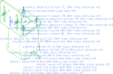

# //pub/examples/partcad/feature_interface

This example demonstrates how the same parametrized assembly
can be defined in three slightly different ways
using three approaches to connect parts to each other,
and a fourth one that carries the instructions to assemble it.

## Seeing the ports and the interfaces

A port is a coordinate frame and an interface is a named set of them.
Neither is geometry, so neither shows up in a drawing - which is exactly
what makes them hard to get right. `pc render` draws them when asked:

<table><tr>
<td valign=top><b><code>--with-ports</code></b><br/>
<a href="./example-bracket.ports.svg"></a></td>
<td valign=top><b><code>--with-interfaces</code></b><br/>
<a href="./example-bracket.interfaces.svg"></a></td>
</tr></table>

`--with-ports` marks every port with its own coordinate frame - the long
arrow is `+Z`, the direction a part travels along when it is connected
through that port - and writes the name a `connectPorts:` would have to use.
`--with-interfaces` names each *instance* of an interface once and draws a
line out to each port that belongs to it, so a bolt pattern reads as the one
connection it is; the small circles are the port boundaries, the `m3` and
`m4` sketches this package defines.

On an assembly the same two options walk everything inside it, which is how
a connection that went wrong is found - two frames that should have met and
did not:

<table><tr>
<td valign=top><b><code>--with-ports</code></b><br/>
<a href="./connect-mates.ports.svg"></a></td>
<td valign=top><b><code>--with-interfaces</code></b><br/>
<a href="./connect-mates.interfaces.svg"></a></td>
</tr></table>

All four are drawings rather than pictures — open any of them to read the
names at full size.

They are checked in, and `pc render` keeps them that way: `example-bracket`
and `connect-mates` each declare two file types of their own in
`partcad.yaml` that draw what the two options draw. `--with-ports` and
`--with-interfaces` are the same thing asked for once, on the command line,
for any object and any output format.

## Holding it while you build it

Two of the interfaces on the drawings above are not features of the parts at
all: `GRIP/L` and `GRIP/R` say where a hand goes. They are instances of
`//builtin:grip`, an interface PartCAD itself declares, and the screws carry
an instance of `//builtin:drive-hex` as well - the socket in the top of the
head.

That is what lets `connect-instructions` say which *tools* each step is
performed with rather than only where the parts end up:

```yaml
how:
  turnTorqueMax: 0.4
  holdWith:
    //builtin:finger: [L, R]    # a finger on each flat of the head
  holdTo:
    //builtin:finger: []        # every place a finger fits on the bracket
  driver:
    //builtin:screwdriver-hex: [socket]
```

`//builtin:finger` and `//builtin:screwdriver-hex` are *tools* (see the
`tools:` section of `//builtin`), and each of them carries a `visual` - a
part that stands for it in a picture. The assembly instruction book draws
that part at the port of the instance the tool acts on, so every step of

```shell
pc render -a -t html connect-instructions
```

shows the two hands and the driver on the joint being made.


## Usage
```shell
# placement == "outer"
pc inspect -a connect-ports
pc inspect -a connect-interfaces
pc inspect -a connect-mates

# the same mount, with the instructions needed to actually assemble it
pc info -a connect-instructions
pc test -a connect-instructions

# placement == "inner"
pc inspect -a -p placement=inner connect-ports
pc inspect -a -p placement=inner connect-interfaces
pc inspect -a -p placement=inner connect-mates

# where the ports are, and which interface each of them belongs to
pc render -t png --with-ports example-bracket
pc render -t png --with-interfaces example-bracket
pc render -a -t png --with-all connect-mates

# the instruction book, with a hand and a driver drawn on every step
pc render -a -t html connect-instructions

# the tools those steps name
pc list tools //builtin
pc info --tool //builtin:screwdriver-hex
```

Every port drawn is also listed in the log, with the exact name to write in
an ASSY file - the names on the drawing are small, and there are a lot of
them.


## Assemblies

### connect-instructions
<table><tr>
<td valign=top><a href="connect-instructions.assy"></a></td>
<td valign=top>The same motor mount, assembled rather than only placed: every connection
carries the instructions needed to actually perform it.
</td>
<td valign=top>Parameters:<br/><ul>
<li>placement: <ul>
<li>inner</li><li><b>outer</b></li>
</ul>
</li>
</ul>
</td>
</tr></table>

### connect-interfaces
<table><tr>
<td valign=top><a href="connect-interfaces.assy"></a></td>
<td valign=top>Demonstrates how to connect parts by specifying interfaces.</td>
<td valign=top>Parameters:<br/><ul>
<li>placement: <ul>
<li>inner</li><li><b>outer</b></li>
</ul>
</li>
<li>motor_tr_connect_to: <ul>
<li><b>TR</b></li>
<li>TL</li><li>BR</li><li>BL</li></ul>
</li>
</ul>
</td>
</tr></table>

### connect-mates
<table><tr>
<td valign=top><a href="connect-mates.assy"></a></td>
<td valign=top>Demonstrates how to provide the minimum information while letting PartCAD
determine the rest using the interfaces' mating metadata.
</td>
<td valign=top>Parameters:<br/><ul>
<li>placement: <ul>
<li>inner</li><li><b>outer</b></li>
</ul>
</li>
<li>motor_tr_connect_to: <ul>
<li><b>TR</b></li>
<li>TL</li><li>BR</li><li>BL</li></ul>
</li>
</ul>
</td>
</tr></table>

### connect-ports
<table><tr>
<td valign=top><a href="connect-ports.assy"></a></td>
<td valign=top>Demonstrates how to connect parts by specifying ports.</td>
<td valign=top>Parameters:<br/><ul>
<li>placement: <ul>
<li>inner</li><li><b>outer</b></li>
</ul>
</li>
<li>motor_tr_connect_to: <ul>
<li><b>TR</b></li>
<li>TL</li><li>BR</li><li>BL</li></ul>
</li>
</ul>
</td>
</tr></table>

<br/><br/>

*Generated by [PartCAD](https://partcad.org/)*
