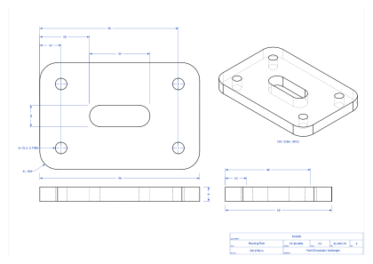

# //pub/examples/partcad/feature_render_custom

PartCAD example: `render:` implementations that another package supplies.

`feature_export_custom` writes an implementation of its own. This package
writes none. It names one that somebody else published - and with it gets a
file type PartCAD has no implementation of at all.

The three drawings below are produced by
[draftwright](https://github.com/pzfreo/draftwright) through
`//pub/feature/render/draftwright`, a package in the public PartCAD index.
Each file type says where the implementation lives (`package`) and which
script in it to run (`path`); every other field is a parameter of the drawing,
handed to that script verbatim.

Nothing has to be installed by hand. PartCAD installs the implementing
package's Python requirements - draftwright, in this case - into the sandbox
it runs that package's implementations in.



That is `bracket.svg`: a fully dimensioned technical drawing, not the flat
projection PartCAD's built-in `svg` renderer produces. The same drawing is
also written as [PDF](./bracket.pdf), and as `bracket.dxf` for a CAD tool to
pick up - too large to keep in the repository, so `pc render` is what puts
it there.

### Why these are `render:` types and not `export:` ones

PartCAD's two output sections are not two names for the same thing:

- `export:` is for files another CAD tool opens as a **part or a sketch** -
  geometry it can go on working with.
- `render:` is for **output files in general** - a drawing, a picture, a
  report.

A technical drawing is a *document about* a part rather than the part:
nothing downstream can load the PDF and machine from it. So all three file
types are declared under `render:`, and the same three would be a lie under
`export:` - they would promise callers geometry this package cannot deliver.

Nothing is lost by that. The section a file type belongs to is decided by
where it is declared, not by which command asked for it, so `pc export -t
pdf :bracket` produces the drawing just as `pc render -t pdf :bracket` does.
What the split settles is not reachability but meaning, and that is the
promise being kept.


## Usage
```shell
pc render :bracket           # all three drawings, and this README
pc render -t pdf :bracket
```

The same implementation draws an object of any other package, without that
package knowing about it. `-e` says which package to read the output
configuration from - the implementing one for its own defaults, or this one
for the drawing parameters set below:

```shell
pc render -t pdf -e //pub/feature/render/draftwright \
    //pub/examples/partcad/produce_part_step:bolt
```


## Parts

### bracket
<table><tr>
<td valign=top><a href="bracket.py"></a></td>
<td valign=top>A mounting plate, drawn rather than projected.</td>
</tr></table>

<br/><br/>

*Generated by [PartCAD](https://partcad.org/)*
