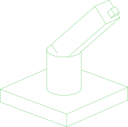

# //pub/examples/partcad/produce_assembly_urdf

URDF assembly examples

## Usage
A URDF file is used as an assembly directly, with no conversion step:

```shell
pc inspect -a robot
```

The reverse direction writes a URDF (plus the mesh files it references) from
any PartCAD assembly:

```shell
pc export -a -t urdf -O ./ robot
pc export -P /produce_assembly_assy -a -t urdf -O ./ :logo
```


## Assemblies

### robot
<table><tr>
<td valign=top><a href="robot.urdf"></a></td>
<td valign=top>A URDF robot description used directly as a PartCAD assembly</td>
</tr></table>

<br/><br/>

*Generated by [PartCAD](https://partcad.org/)*
