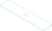
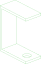

# //pub/examples/partcad/produce_part_cadquery_logo

PartCAD example project which implements its logo.

## Usage
```shell
pc inspect head_half
pc inspect bone
```


## Parts

### bone
<table><tr>
<td valign=top><a href="bone.py"></a></td>
<td valign=top>Plate used as one of the bones on PartCAD logo</td>
<td valign=top>Parameters:<br/><ul>
<li>tolerance: 0.2</li>
<li>bore: 7.188</li>
</ul>
</td>
</tr></table>

### bone_tapped
<table><tr>
<td valign=top><a href="bone.py"></a></td>
<td valign=top>The same plate, tapped M8 so the bolt takes hold in it</td>
<td valign=top>Parameters:<br/><ul>
<li>tolerance: 0.2</li>
<li>bore: 8.0</li>
</ul>
</td>
</tr></table>

### head_half
<table><tr>
<td valign=top><a href="head_half.py"></a></td>
<td valign=top>Bracket used as one side of the head on PartCAD logo</td>
<td valign=top>Parameters:<br/><ul>
<li>tolerance: 0.2</li>
<li>bore: 9.0</li>
</ul>
</td>
</tr></table>

### head_half_tapped
<table><tr>
<td valign=top><a href="head_half.py"></a></td>
<td valign=top>The same bracket, tapped M8 so the bolt takes hold in it</td>
<td valign=top>Parameters:<br/><ul>
<li>tolerance: 0.2</li>
<li>bore: 8.0</li>
</ul>
</td>
</tr></table>

<br/><br/>

*Generated by [PartCAD](https://partcad.org/)*
