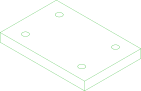
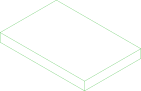

# //pub/examples/partcad/produce_part_subtractive

This example demonstrates parts that are made by taking material away from a piece of stock. Each one names the stock it is cut from with `source:`, and each names the machine that cuts it -- a router, a laser, a drill or a saw -- which is what decides both the checks `pc test` applies to it and the program `pc cam` writes for it.

## Usage
```shell
pc inspect stock_sheet
pc inspect blank
pc inspect gasket
pc inspect bearing_block
pc inspect drilled_plate
pc inspect rail
pc test -f manufacturability
```

Each part's route is written for the machine it declares -- the same file
type, three different programs:

```shell
pc cam -O ./routes blank             # a laser: one pass, kerf offset, M3/M5
pc cam -O ./routes bearing_block     # a router: contours at stepped depths
pc cam -O ./routes drilled_plate     # a drill: plunge and retract, per hole
```

`gasket` says it could be cut either way, so it is asked which -- and the
two programs land beside each other rather than one overwriting the other:

```shell
pc cam -O ./routes -m laser gasket   # writes gasket.laser.nc
pc cam -O ./routes -m cnc gasket     # writes gasket.cnc.nc
```


## Parts

### bearing_block
<table><tr>
<td valign=top><a href="bearing_block.py"></a></td>
<td valign=top>What a router does that the other two cannot: a pocket with a flat floor partway down, and a chamfer around the top edge. The chamfer is a wall at 45 degrees to the tool axis, which no beam and no drill produces -- so this part declares `cnc:` alone, and the laser check does not apply to it.
</td>
<td valign=top>Parameters:<br/><ul>
<li>tolerance: 0.1</li>
</ul>
</td>
</tr></table>

### blank
<table><tr>
<td valign=top><a href="blank.py"></a></td>
<td valign=top>A flat strip cut out of the sheet by a laser, and the piece the sheet metal example bends. Nothing but an outline: a beam that goes straight through leaves walls parallel to itself, which is all this part has.
</td>
<td valign=top>Parameters:<br/><ul>
<li>tolerance: 0.1</li>
</ul>
</td>
</tr></table>

### drilled_plate
<table><tr>
<td valign=top><a href="drilled_plate.py"></a></td>
<td valign=top>The plate with nothing done to it but four holes. Its outline is the stock's outline, because the drill did not cut it -- which is why `source:` matters most here: it is what has the check judge the material taken away rather than the part left behind.
</td>
<td valign=top>Parameters:<br/><ul>
<li>tolerance: 0.1</li>
</ul>
</td>
</tr></table>

### gasket
<table><tr>
<td valign=top><a href="gasket.py"></a></td>
<td valign=top>A part with features in it -- a rounded outline, a bore and six bolt holes -- all of them walls a beam can make. Curves cost a laser nothing; what it cannot do is tilt, which is what the chamfer on `bearing_block` needs.
It is also the one part here that says it could be made *either* way. Those are alternatives rather than stages -- `pc cam -m laser gasket` and `pc cam -m cnc gasket` are two programs for the same part, and `pc test` answers for both claims. A part that really is machined in stages is a chain of parts, each naming the previous as its `source`.
</td>
<td valign=top>Parameters:<br/><ul>
<li>tolerance: 0.1</li>
</ul>
</td>
</tr></table>

### rail
<table><tr>
<td valign=top></td>
<td valign=top>A 250 mm piece of the board, cut off its end by a saw. A saw makes nothing but the stock with its ends cut off, so `cut:` says where it cuts rather than how -- the axis the saw travels along and how far into the board it goes, where `$length` is the value of this part's own `length` -- and `manufacturability-cut` checks that cutting the stock there leaves exactly this part. `pc cam` writes nothing for it: a saw runs no program.
</td>
<td valign=top>Parameters:<br/><ul>
<li>length: 250.0</li>
<li>tolerance: 0.1</li>
</ul>
</td>
</tr></table>

### stock_board
<table><tr>
<td valign=top><a href="stock_board.py"></a></td>
<td valign=top>A board, bought by the length: a 38 x 89 mm section as long as its `length` parameter says. Like the sheet and the plate it declares no `manufacturing:`, because nobody here makes it.
</td>
<td valign=top>Parameters:<br/><ul>
<li>length: 600</li>
<li>tolerance: 0.1</li>
</ul>
</td>
</tr></table>

### stock_plate
<table><tr>
<td valign=top><a href="stock_plate.py"></a></td>
<td valign=top>The plate the router and the drill work on, 12 mm thick. Bought like the sheet, and named by the two parts below.
</td>
<td valign=top>Parameters:<br/><ul>
<li>tolerance: 0.1</li>
</ul>
</td>
</tr></table>

### stock_sheet
<table><tr>
<td valign=top><a href="stock_sheet.py"></a></td>
<td valign=top>The sheet the laser cuts out of, 2 mm thick. It declares no `manufacturing:` at all, because nobody makes it here -- it is bought, and what is done to it is the business of the parts that name it as their `source`.
</td>
<td valign=top>Parameters:<br/><ul>
<li>tolerance: 0.1</li>
</ul>
</td>
</tr></table>

<br/><br/>

*Generated by [PartCAD](https://partcad.org/)*
